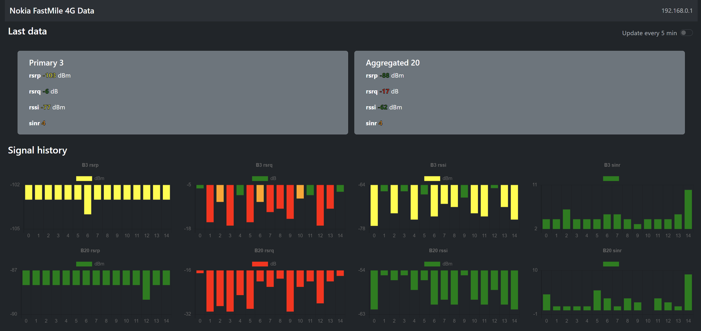

# Nokia FastMile 4G Monitor



Small application written in Node.js to get some historical data for signal and carrier aggregation.

## Functionality
Simple data gatherer from the status page of the router, because an API is not discovered or available.

### Signal history
This small service stores signal data related to the 4G every 2 minutes from the router.

### Bands changes
Registers eventual changes in band selection. In details, stores changes in primary band and carrier aggregated bands.

## Execution

To run the server, first do
```
npm install
```
then run 
```
npm start
```

After this command, access `http://localhost:3333/` and insert the FastMile 4G IP address in the popup. Data won't be readily available, just wait a bit.

